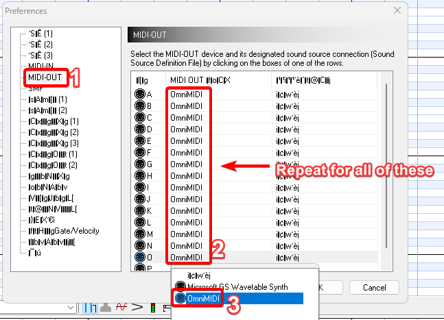
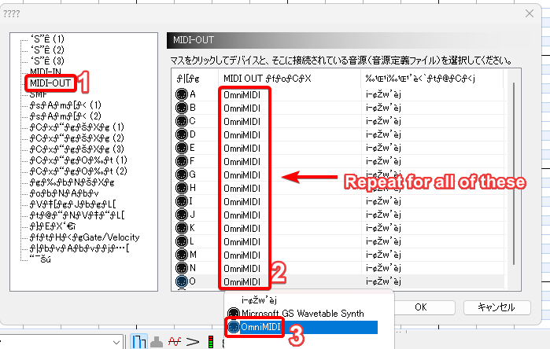

# Configuring Audio

When you first boot up Domino, you may notice that you do not have any audio playing. That is because by default Domino has no MIDI outs setup. This is how you setup Domino to play audio.

??? warning "Synth Required"

    For this to work, you will need a synth setup and running on your system. Windows provides a default synthesizer for you, but it is terrible in performance.
    I recommend you to use [OmniMIDI](/OmniMIDI) for your synthesizer as this synth was made for Black MIDIs and provides the best performance.

## Configuring MIDI Outs

As previously stated, Domino by default has no MIDI outs set up. You will need to set these up in preferences in order for audio to work.

On the toolbar, click the wrench icon to open up your preferences. You can also just click <kbd>F12</kbd>

In the preferences, you will want to head to MIDI-OUT and click the OmniMIDI option under MIDI OUT for A-P.

??? note "Japanese UI"

    

After you have selected OmniMIDI for ports A-P, click OK to save and close the preferences and you should now have audio! Enjoy blacking with live feedback on your song!
