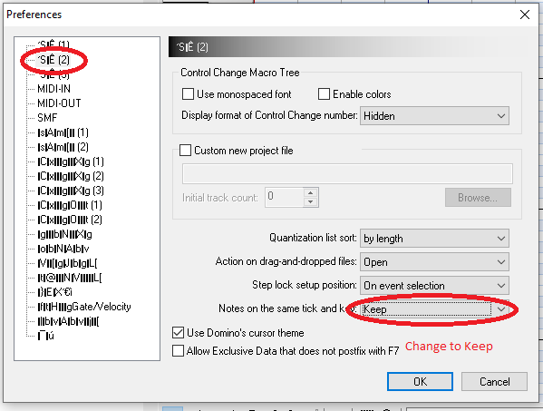
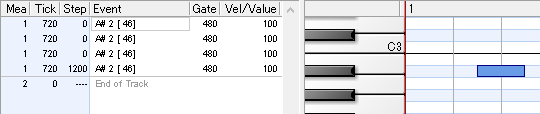

# Getting Started

This guide will help you get started on downloading and setting up Domino for the best working environment

## Installation

!!! info "Different Domino Versions"

    As discussed in the home page, there are 3 versions of Domino which you can choose. Click on a link to be directed to visit their download pages:

    -   [The normal 32-bit version](https://takabosoft.com/domino)
    -   [The community-translated version](https://github.com/Hans5958/Domino-English-Translation/releases/latest)
    -   [The 64-bit dev version](download/Domino145_dev002_x64.zip)

    You are free to choose any version you'd wish to use, but I will be using the english translated version.

First, download the version of Domino you wish to use.

??? note "For the english translated version, you will want the **zip version**."

    

Unzip the file you downloaded anywhere you'd like and you should see the following files:

Congratulations, you have successfully installed Domino. Feel free to create a shortcut or something to your Desktop or pin to your taskbar.

## Enabling Overlapping Notes

By default, Domino will remove notes on the same tick and in the same track. This is sometimes not ideal when making Black MIDIs, but is a setting you can fortunately change! Here is how to do it

On the toolbar, click the wrench icon to open up your preferences. You can also just click <kbd>F12</kbd>

Click on the 2nd option, and change "Notes on the same tick and key" to "Keep"

??? note "Japanese UI"

    

You can now click OK to save your changes. After which you will be able to place multiple notes on the same tick and the same track, thus overlapping notes!

