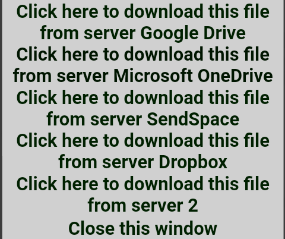

# Recommended Soundfonts

Here are some great soundfonts which we recommend you to use for you endevaours in Black MIDI. All soundfonts here are free to download and use.

!!! warning "Credit the creators!"

    These soundfonts were created by amazing individuals who worked hard to create them and are kind enough to offer them for free for you to use. Please show some love by crediting the creators if you make videos or use them!

## Arachno

| Author      | Format | Has GM?             | Download                                                                              |
| ----------- | ------ | ------------------- | ------------------------------------------------------------------------------------- |
| ArachnoSoft | SF2    | :octicons-check-24: | [ArachnoSoft Website](https://www.arachnosoft.com/main/download.php?id=soundfont-sf2) |

Arachno is a really nice soundfont, it's one of the most used soundfonts in the Black MIDI Conmunity for GM sounds.
It has a lot of instruments, such as drums, percussion and more!
The download page for arachno can be found on the [Arachnosoft website.](https://www.arachnosoft.com/main/download.php?id=soundfont-sf2)

??? note "You will get multiple download options, i recommend using the Google Drive one."

    

Arachno is mainly a .sfARK file, however the download above is the .sf2 version which can be used in most synth's, including OmniMIDI

## Keppy's Steinway Piano

| Author | Format | Has GM?         | Download                                                                             |
| ------ | ------ | --------------- | ------------------------------------------------------------------------------------ |
| Keppy  | SFZ    | :octicons-x-24: | [GitHub Mirror](https://github.com/rastating/Keppy-Steinway-Piano/releases/tag/6.27) |

Keppy's Steinway Piano is a soundfont sampled from a real Steinway D-274 piano, just like arachno it's one of the most used soundfonts in the Black MIDI Community.
This soundfont only has the piano, any other instruments (such as drums) aren't in Keppy's Steinway Piano.
The original repo has since been taken down. Fortunately, someone mirrored it [here on GitHub](https://github.com/rastating/Keppy-Steinway-Piano). The latest version in this is 6.27.

Keppy's Steinway Piano is a .sfz file, this means you need the samples too.
For the samples and all of the versions, [use this link](https://github.com/rastating/Keppy-Steinway-Piano/archive/refs/tags/6.27.zip).

## K-Bass Deluxe 4

| Author    | Format | Has GM?         | Download                                                           |
| --------- | ------ | --------------- | ------------------------------------------------------------------ |
| ponluxime | SFZ    | :octicons-x-24: | [#releases in pon's server](https://discord.com/invite/ePRZYuG6zf) |

K-Bass Deluxe 4 is a soundfont from the K-Bass Deluxe series. Similar to Keppy's Steinway Piano, it doesn't have any other instruments.
This soundfont is also a .sfz file, same as Keppy's Steinway Piano.
The download to this one is not available outside discord, to get it you have to join [Pon's server](https://discord.com/invite/ePRZYuG6zf) and go to the #releases channel to find it. Pon's server also has some other free soundfonts!

## Amethyst Imperial Grand

| Author | Format | Has GM?         | Download                                                            |
| ------ | ------ | --------------- | ------------------------------------------------------------------- |
| MBMS   | SFZ    | :octicons-x-24: | [Github](https://github.com/MyBlackMIDIScore/AmethystImperialGrand) |

Amethyst Imperial Grand is a beautiful soundfont by MBMS. It's a piano soundfont that has multiple versions, some being realistic. It's very reverby and beautiful for videos. Similar to Keppy's Steinway Piano, it doesn't have any other instruments.
This soundfont is also a .sfz file, same as Keppy's Steinway Piano.
The download to this one is on [MBMS' GitHub.](https://github.com/MyBlackMIDIScore/AmethystImperialGrand)

## Khor Keys Concert Grand 4

| Author    | Format | Has GM?         | Download                                                                             |
| --------- | ------ | --------------- | ------------------------------------------------------------------------------------ |
| Han SeRin | SFZ    | :octicons-x-24: | [MEGA.nz](https://mega.nz/file/yWZDwaBL#Cna4LyylWnuTnrGBMxrYGaEzoRINFOQTnHfedbcWLZA) |

Khor Keys Concert Grand 4 is definitely one of the biggest soundfonts in this list. KK4 is made by HSR, it's a soundfont that has a lot of samples and many different versions.

This one is also an .sfz file.
The download to this one can be found on [HSR's video](https://youtu.be/-aPpXwZDMsE), where it links to a [MEGA.nz link](https://mega.nz/file/yWZDwaBL#Cna4LyylWnuTnrGBMxrYGaEzoRINFOQTnHfedbcWLZA).
