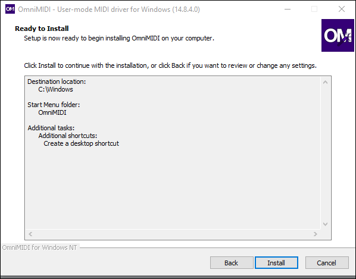
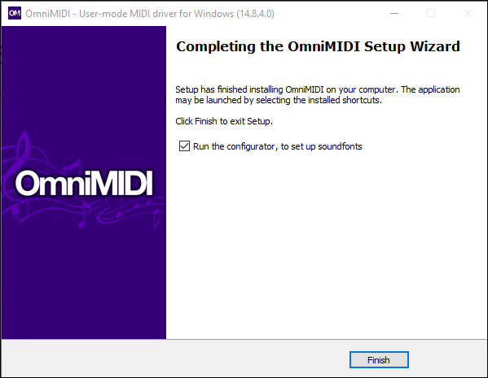
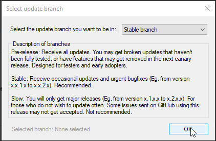
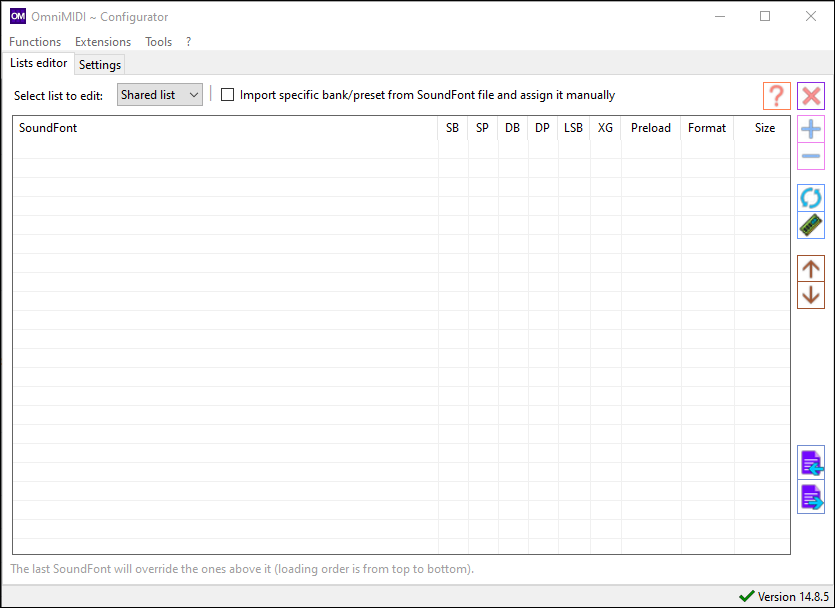

# Getting Started

This guide will help you get started with [OmniMIDI](https://github.com/KeppySoftware/OmniMIDI).

## Installation

??? note "System Requirements"

    You can view the full system requirements at the [source repo](https://github.com/KeppySoftware/OmniMIDI#minimum-system-requirements-for-midi-playback-on-x86x64-systems)

    In general, you will want at least:

    - 64-bit processor running at 1.5 GHz
    - 1 GB of memory
    - DirectX 9 capable sound card or better
    - Windows Vista and up

    If your PC is relatively new, you should not have any issue running OmniMIDI

First head to the latest release download page. The latest version as of writing this guide is 14.8.5, which you can download by clicking [here](https://github.com/KeppySoftware/OmniMIDI/releases/tag/14.8.5.0). You will want to download the `OmniMIDISetup.exe`.

Next, run the installer. If you get a Windows Smart Screen pop up, click "Read more" and then click "Run anyway" button. OmniMIDI is safe to use and install if you get it from the official OmniMIDI repository linked above.

Make sure to allow it admin privliges and you will now see an installer pop up. Run through the installer as you would with installing any other program. At the end make sure to tick the box to open the configurator when the installer closes.

??? info "Installation Screenshots"

    === "Start"

        

    === "Before Install"

        

    === "Installed"

        

    === "Finalizing"

        !!! note "Make sure that 'Run the configurator' is checked"

        

## First Launch

When first loading up OmniMIDI, you will be presented with the following screen. In the dropdown, select "Stable branch" and then click OK. This will only update OmniMIDI every stable release.

The next screen will ask you to donate. If you would like to donate to support the dev of OmniMIDI, feel free to do so. If not, click either "Remind me next month" or "Never show me this again."

Now you should arrive at the main screen of the OmniMIDI configurator! You are now ready to configure OmniMIDI!

!!! note "Reopening the Configurator"

    If and when you close this window you can always open it back up by searching for "Configure OmniMIDI" in the start menu.

Here are some links to helpful things you can configure in OmniMIDI.

-   [Adding Soundfonts](Soundfonts/configuration.md)
-   [WinMM Patch](winmm-patch.md)
