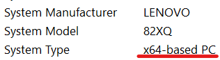

# Getting Started

This guide will help you get started with Piano From Above.

> TODO: Add prerequisites section for installing DirectX

## Installation

!!! info "Different PFA Versions"

    As discussed in the home page, there are 3 versions of PFA which you can choose. Click on a link to be directed to visit their download pages:

    -   [The 32-bit version](https://github.com/brian-pantano/PianoFromAbove/releases/download/1.1.0/PFA-1.1.0-x86.exe)
    -   [The 64-bit version](https://github.com/brian-pantano/PianoFromAbove/releases/download/1.1.0/PFA-1.1.0-x86_64.exe)
    -   [Khang's viz mod](https://github.com/khang06/PianoFromAbove/releases/latest)

    You are free to choose any version you'd wish to use, but I will be using the official versions.

First, download the version you can use. 32-bit is for x86 OSes, 64-bit is for x64 OSes.

??? note "How do I know if I'm on 32-bit or 64-bit system?"

    First, type in the search bar "System Information" and open it. In the "System Type" line you will see if you're on x64 or x86.
    <br>
    

After you download it, open up the exe file and you are done! You are able to place this exe anywhere.

## Opening MIDI Files

Opening MIDI files is as simple as pressing <kbd>Ctrl</kbd> + <kbd>O</kbd> and opening a MIDI from your drive.

### Adding MIDI Files

This is if you would like to add MIDI files to the left sidebar. This is not recommended to add such large MIDIs as it will take more system resources to load, but the option is yours

First press <kbd>Ctrl</kbd> + <kbd>F</kbd> to open up a file selecter. Go to location of your midi file, select it and press open. It might take some RAM, CPU AND GPU usage to load it.

After that, in the library you will see the MIDI file. Double click it and now you're playing a MIDI!

## Viewing 128 keys

There are 2 ways of displaying 128 keys

### Show Song Keys Method

PFA is normally at 88 keys. To change that press <kbd>Ctrl</kbd> + <kbd>P</kbd> to open preferences. Here change "Show all 88 keys" to "Show song keys". Press OK and now you have 128 keys if the midi file you're playing has that key range.


### Editing config.xml Method

This method will always show the full 128 keys even if the MIDI has less keys than that.

Find your config.xml file in your `%appdata%` folder. The path should be `%appdata%/Piano From Above/Config.xml`.


Open this file up in any text editor and edit line 3 where it says `FirstKey` to `"0"`, and `LastKey` to `"127"`.

The line should now look something like this:

```xml
<Visual KeysShown="0" AlwaysShowControls="0" AssociateFiles="0" FirstKey="0" LastKey="127">
```

Save and close the file. Now restart your PFA and you should now see 128 keys at all times.
