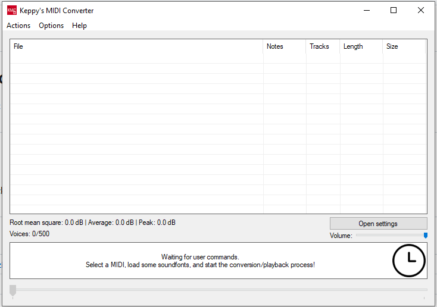

# Rendering Black MIDI Audio

To start rendering Black MIDI audio, you will need an audio renderer.

## Keppy's MIDI Converter (KMC)

??? info "What is Keppy's MIDI Converter?"

    Keppy's MIDI Converter (abbreviated as KMC) is an open-source Black MIDI audio renderer made by Keppy. It is a great option for the starter to render Black MIDI audio easily and quickly.

    Here is a preview of KMC:

    

KMC is great at delivering fast and reliable audio renders for you Black MIDI. It is mostly used in the Black MIDI Community as it is easy to use, and reliable.

| Pros              | Cons |
| ----------------- | ---- |
| Good for starters |      |
| Loudmax included  |      |

### Setup

[Click here to get started with using KMC](../../KMC/)
