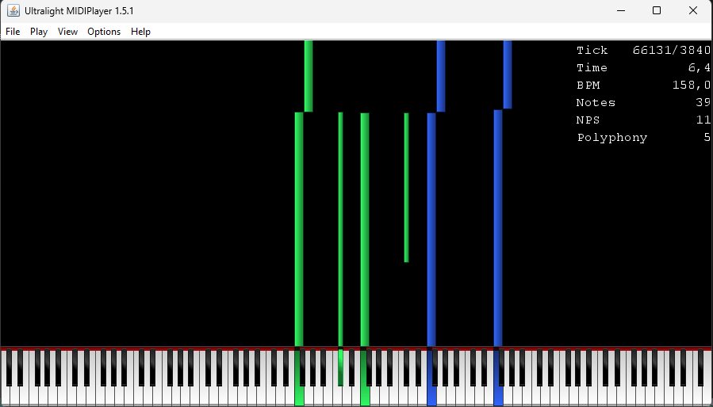

# Rendering Black MIDI Video

To start rendering Black MIDI videos, you will need a video renderer.

There are two recommended options that you can choose to render your own Black MIDI videos, Zenith and Ultralight MIDI Player.

## Zenith

??? info "What is Zenith?"

    Zenith is an open-source Black MIDI renderer made by Arduano. It is a great option for the starter to render Black MIDI easily.

    Here is a preview of Zenith:

    

??? warning "Depreciated Project"

    Arduano, the creator of Zenith, has recently made an announcement on the GitHub repo that the project is no longer supported. The latest version of Zenith still works splendid, so Zenith will continue to be recommended. **Except no new features.**

Zenith not only renders videos for your Black MIDI, but also includes note count rendering which can be customized easily.

Zenith has 2 versions which you can choose to start with:

-   [The original Zenith](https://github.com/arduano/Zenith-MIDI), made by Arduano
-   [Modded version](https://github.com/null7323/Zenith-MIDI-Modded), made by null7323, featuring more features and is faster than the original one (1)

1. Features include customizable preview resolution, threads and memory limiter, and memory saving options.

| Pros                                | Cons                                                        |
| ----------------------------------- | ----------------------------------------------------------- |
| Good for starters.                  | Very slow when rendering (unless using the modded version). |
| Can be customized by using plugins. | Can't be used on older PCs.                                 |
| Extremely RAM optimized.            | Depreciated                                                 |

### Setup

[Click here to get started with using Zenith](../../Zenith/)

## Ultralight MIDI Player

??? info "What is Ultralight MIDI Player?"

    Ultralight MIDI Player (abbreviated as UMP) is a Java-based Black MIDI renderer developed by PipiraMine. Not only for rendering, it is also possible to play Black MIDI there. It is known to the community because of how fast it goes when rendering and customizing the skins.

    Here is a preview of UMP:

    

UMP has both release and beta versions. The release version has no bugs meanwhile beta version has early features included.

| Pros                                                    | Cons                                                |
| ------------------------------------------------------- | --------------------------------------------------- |
| Great performance when rendering or playing Black MIDI. | Only for experts and not recommended to starters.   |
| Possible to customize the skins using a resource pack.  | CPU speed also impacts UMP performance.             |
| Faster MIDI load and less memory usage.                 | WinMM patch is required (for Windows 10 and later). |
| Can be used on older PCs.                               | Java.                                               |

### Setup

[Click here to get started with using UMP](../../UMP/)
